<h1 align="center">ML Workbook</h1>

## Description
These are my initial footsteps into Machine Learning.
I have tried to implement ML/DL algorithms from scratch using numpy, because getting your hands dirty is the best way to learn.

## Comparision of optimization Algorithms on MNIST dataset
[Source code](./src/dl/example.py)

I have compared the performance of a Dense network with different optimizers.
Models used same test and train datasets. Here are the results.
​

 
    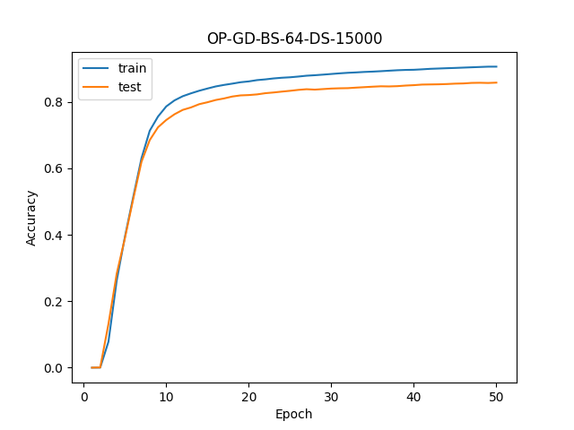

 
    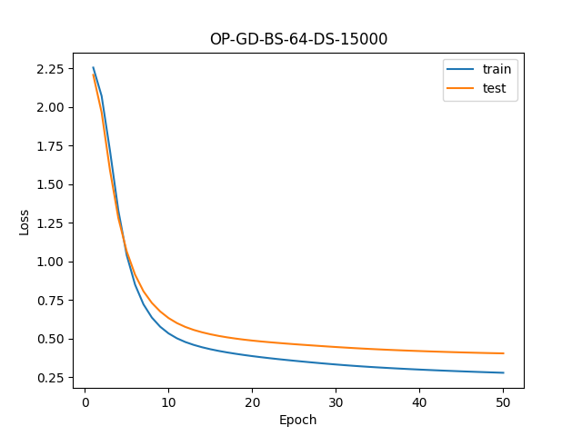

​

 
    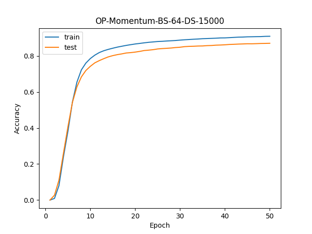

 
    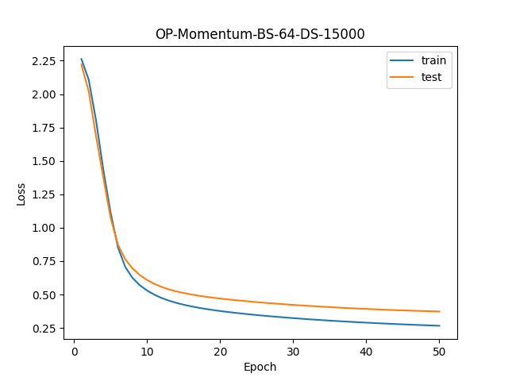

 
    

 
    

 
    

 
    

## Comparision of some common ML classification Algorithms 
[Source code](./src/misc/classifier_comparision.py)

I have tried to compare the performance of some common ML Algorithms on sklearn datasets.
I have also compared Sklearn's implementation with my scratch implementation with side by side.

Models used same test and train datasets. Here are the results.
​

 
    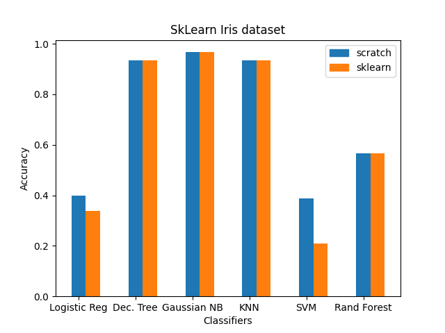

​

 
    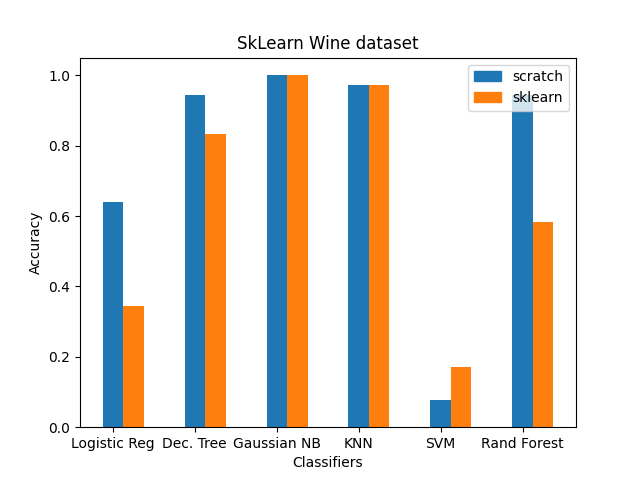

 
    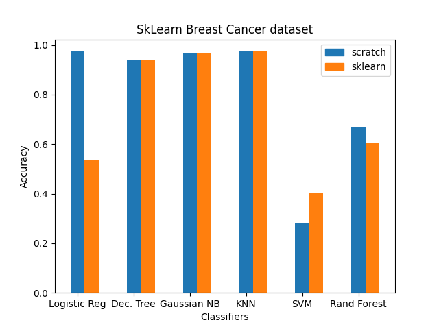

​

## Clustering data with K-Means
[Source code](./src/ml/k_means/example.py)
​

 
    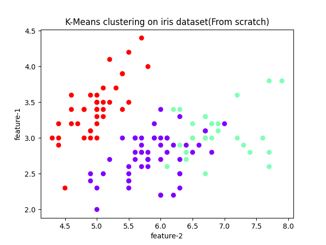

​

 
    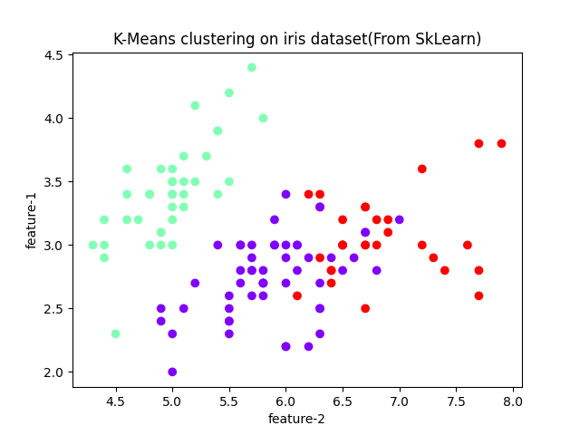

 
    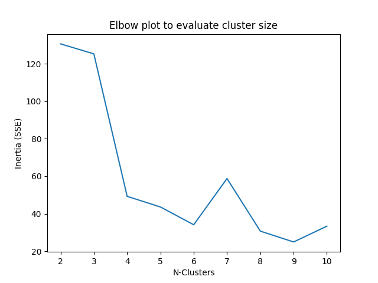

## Dimensionality Reduction with PCA
[Source code](./src/ml/pca/example.py)
​

 
    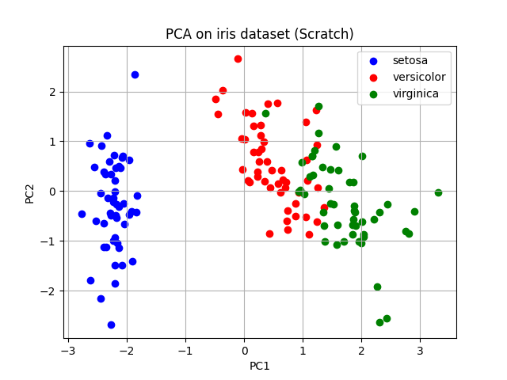

​

 
    

 
    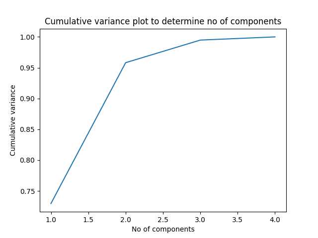

​